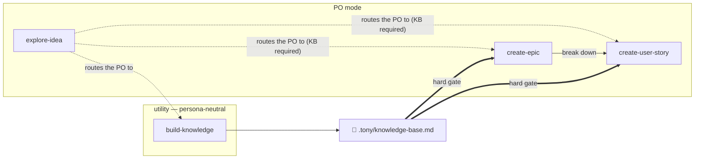

# Tony AI tools

```
=============================
 _                          
| |_    ___    _ __    _   _ 
| __|  /   \  | '_ \  | |_| |
| |    | | |  | | | |  \__, |
|_|    \___/  |_| |_|     |_/ 

=============================
```
`tony` turns raw product ideas into artifacts your team can build from:
- **Epics** — outcome-oriented bodies of work with clear scope and success metrics
- **User stories** — validated with [INVEST](https://en.wikipedia.org/wiki/INVEST_(mnemonic)) and [3C](https://ronjeffries.com/xprog/articles/expcardconversationconfirmation/) practices before they ever reach your backlog

Load your reference documents (PRDs, research, strategy docs, PDFs, spreadsheets, URLs) as an evidence baseline: `build-knowledge` converts them to markdown, builds an Obsidian-compatible wiki with **TF-IDF + vector search indexes** — a file-based vector store built on **SQLite + the `sqlite-vec` extension, with local embeddings via `fastembed`** (see `tools/vector_index.py`) — and synthesizes a cited knowledge base. Epics and stories are then **supported** by cited facts — or **pushed back** when they contradict what your documents say.

> Have an idea? Load your evidence first with `/tony build-knowledge`, then describe the idea and get backlog-ready epics and stories.

Run `tony` with no arguments at any time to see the command list.

## Available skills

Skills fall into one of two modes: **PO mode** — they act on your behalf as a product owner, applying your saved PO personality — and **utility mode** — persona-neutral machinery. `build-knowledge` is a **hard prerequisite for the shaping skills only**: `create-epic` and `create-user-story` refuse to run until a knowledge base exists, so every artifact stays grounded in cited facts. `explore-idea`, the entry point, only needs the idea — it uses the knowledge base opportunistically if one is present.

- **explore-idea** *(PO mode)* — entry point: loads global guidelines, captures and clarifies the idea, runs an opportunistic evidence pass (supporting claims and contradictions) when a knowledge base is present, and routes to the right skill
- **build-knowledge** *(utility, persona-neutral)* — full document pipeline: converts sources, quality-gates them, builds a wiki + retrieval indexes (TF-IDF and vector), and synthesizes the knowledge base (`.tony/knowledge-base.md`)
- **create-epic** *(PO mode)* — understands an idea and shapes it into one or more well-formed epics (`docs/epics/`), grounded in the loaded knowledge base
- **create-user-story** *(PO mode)* — breaks an idea or epic into user stories, each self-validated against INVEST + 3C before it is written (`docs/user-stories/<epic-name>/`)

Every generated user story respects the INVEST + 3C validation rules: one role, one action, one benefit; acceptance criteria that are objectively pass/fail; no hidden assumptions; nothing that can't fit in a sprint.

## Typical workflow



Shaping skills are gated on the evidence layer, not on each other: `build-knowledge` runs first (it produces the knowledge base); once `.tony/knowledge-base.md` exists, start your shaping wherever you are — already know the epic? Go straight to `create-user-story`. `explore-idea` is only the entry point: it captures the idea and **routes the PO** to the right command — it does not load documents or shape anything itself. It can direct the PO to `build-knowledge` when no baseline exists yet, but it never feeds the knowledge base.

## Operating principles

Every skill runs under four rules:
- **Precision** — respond to exactly what's asked: one clarifying question when the idea is ambiguous, no unsolicited alternatives, no speculative implementation.
- **Efficiency** — cap context usage: `ls`/`grep` before reading, skip files already in context, batch independent reads/writes, keep output concise.
- **Safety** — verify before acting: never assume a file exists, never invent metrics or users for an epic, cite claims as `file:line`, ask explicit confirmation before overwrites or destructive commands.
- **Formatting** — no preamble or filler, structured markdown output, every response tagged with `[Active Agent: Role | Task: #ID]`.

> When these conflict, priority is safety > precision > formatting > efficiency.

## Requirements

- Node.js >= 18
- [OpenCode](https://opencode.ai), [Claude Code](https://claude.com/claude-code), and/or [GitHub Copilot CLI](https://github.com/github/copilot-cli) — the Claude Code installer shells out to the `claude` CLI, so it must be on your `PATH`
- Local folder where generated artifacts live, by default `tony` writes to the `docs` folder
- Python 3.10+ + pip packages — required for `/tony build-knowledge`, which is a hard prerequisite for PO shaping (epics and stories):
  ```bash
  pip install -r tools/requirements.txt   # markitdown, numpy, fastembed, sqlite-vec
  ```
  Note: vector search runs fully local — `fastembed` produces embeddings and `sqlite-vec` stores/retrieves them inside `kb.db`; nothing leaves your machine.
  Without the document pipeline you cannot build the knowledge base, so `create-epic` and `create-user-story` refuse to run. See [`tools/README.md`](tools/README.md) for details on the vendored tools.

## Product owner personality

PO-mode skills act with a captured PO personality, stored as a validated config at `.tony/personality.json`. It is **captured by selection only, never written** — the first PO-mode run presents three pickable option lists (a native selectable picker, one-click/tap): **archetype** (`evidence-driven` \| `speed-to-market` \| `customer-vision` \| `balanced`), **tone** (`direct` \| `warm` \| `concise` \| `formal` \| `approachable`), and **working rule** (`evidence-first` \| `ship-fast` \| `user-centered` \| `balanced`). The PO just selects each, never types. Values outside these presets are rejected as a processing error.

## Installation

```bash
npm install -g @my-tony/ai-tools
```

## Project structure

```
<project_root>/
├── docs/
│   ├── ideas/                    # captured ideas persisted by explore-idea
│   ├── epics/                    # epic files generated by create-epic
│   └── user-stories/             # one folder per epic; story files generated by create-user-story
└── .tony/
    ├── knowledge-base.md        # cited claims + conflicts (synthesized from the wiki)
    ├── personality.json        # captured PO personality config (validated params, see "Product owner personality")
    ├── .story-registry.json     # create-user-story generation results
    ├── raw-documents/           # drop source files here (pdf, docx, xlsx, pptx, html, txt)
    ├── md-documents/            # converted markdown sources + manifest.json
    ├── wiki/                    # Obsidian-compatible wiki (MOC + category pages)
    └── index/                   # TF-IDF store + kb.db (SQLite + sqlite-vec vector store)
```

### OpenCode

```bash
cd my-project
tony install --opencode    # repository level (current directory)
```

OpenCode installs are always repository level — there's no `--global` option, since OpenCode looks for a config file per project.

The installer:

1. Finds the nearest `opencode.json` (or `.jsonc`), walking up from the current directory — creates one when none exists, and converts an existing `.jsonc` to `.json`.
2. Registers the plugin path in the config's `plugin` array (no-op if already present).
3. Scaffolds `.tony/raw-documents/` in the project (idempotent) — the canonical drop point for source documents used by `/tony build-knowledge`.

Restart OpenCode afterwards — plugins are loaded at startup.

**How the commands appear:** `/tony` (entry point, defaults to explore-idea), `/tony explore-idea`, `/tony build-knowledge`, `/tony create-epic`, `/tony create-user-story`.

### Claude Code

```bash
cd my-project
tony install --claude-code             # repository level (current directory)
tony install --claude-code --global    # global (user scope, all projects)
```

Without `--global`, the installer works at repository level: it writes `extraKnownMarketplaces` and `enabledPlugins` into `./.claude/settings.json`. Commit that file and teammates get prompted to install the plugin automatically when they open the project. With `--global`, the plugin is installed at user scope for all projects and the current directory doesn't matter.

The installer:

1. Ensures `.claude-plugin/plugin.json` and `.claude-plugin/marketplace.json` exist in the package — created if missing; an existing `marketplace.json` gets the tony entry merged in without touching other entries.
2. Registers the package directory as a plugin marketplace and installs `tony@tony-ai-tools` through the `claude` CLI.
3. Removes any legacy `.claude/skills/tony` install left by older versions (only after the plugin install succeeds).
4. Repository-level installs also scaffold `.tony/raw-documents/` in the project — skipped for `--global`, which is not tied to a project.

Restart Claude Code afterwards (exit and run `claude` again) — plugins are discovered at startup.

**How the commands appear:** the command picker lists skills by their short name with the plugin as a label — `/explore-idea (tony)`, `/build-knowledge (tony)`, `/create-epic (tony)`, `/create-user-story (tony)`. The namespaced form `/tony:<skill-name>` also works when typed, but Claude Code only *displays* it when another plugin defines a skill with the same name.

Alternatively, without npm or the `tony` CLI (requires the `.claude-plugin/` manifests to be committed to the repo):

```bash
claude plugin marketplace add jersson/tony-ai-tools
claude plugin install tony@tony-ai-tools
```

### GitHub Copilot CLI

```bash
cd my-project
tony install --copilot             # project level (current directory)
tony install --copilot --global   # user level (all projects)
```

The project installer creates `.github/skills/tony` as a link to the package's
skills directory. The global installer creates `~/.copilot/skills/tony`, which
makes the skills available across projects. Existing non-Tony paths are never
overwritten.

Restart Copilot CLI or run `/skills reload` after installation. The skills are
invoked by their individual names: `/explore-idea`, `/build-knowledge`,
`/create-epic`, and `/create-user-story`. Copilot also supports managing skills
with `copilot skill list`.

## Uninstall

```bash
tony uninstall --opencode                # repository level (current directory)
tony uninstall --claude-code             # repository level (current directory)
tony uninstall --claude-code --global    # global (user scope)
tony uninstall --copilot                # project level (current directory)
tony uninstall --copilot --global       # user level (all projects)
```

The Claude Code variant uninstalls the plugin, removes the marketplace registration, and cleans up legacy installs. The Copilot variant removes only the Tony-managed skills link.

## Version

```bash
tony --version    # or tony -v
```

## License

[MIT](LICENSE)
